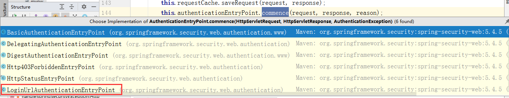

# spring-security

### 写在前面

##### 基于Session的认证方式

在之前单体架构时代，我们认证成功之后会将信息存在Session中，然后响应给客户端的是对应的Session中的数据的key，客户端会将这个key存储在cookie中，之后的请求都会携带这个cookie中的信息。


相当于你携带了一张身份证，你每次访问服务器，我只要根据身份证上的信息和服务器后台比对成功，你就可以通过。

但是随着架构的演变，在项目很多的情况下，我们会选择分布式或者前后端分离，这样的情况下session的认证的方式就存在一些问题

* session的跨域问题，和session共享需要解决
* cookie存储的内容大小为4k
* cookie的有效范围是在当前域名下，所以在分布式环境下或者前后端分离的项目中不适用。
* 服务器存储了所有认证过的用户信息，一旦服务器宕机，会丢失所有的用户信息。

#### 基于Token的认证方式

相较于session对需求的兼容，基于Token的方式便是我们在挡下项目中处理认证和授权实现方式的首先了，Token的方式其实就是在用户认证成功后，就把用户的信息通过加密封装到Token中，在响应客户端的时候将Token信息传回客户端，当下一次请求到来的时候，在请求的Http请求head的Authentication中携带token。


一般来说，token可能还会携带超时时间之间的内容，让用户再次进行登录操作之类的。

由于token里面自带了用户的信息，所以我们可以将原本存储与session的内容压力均摊给客户端，这就相当于服务器发给你一张加密的身份证，类似上班的工作卡，只要你出示这个，你就一定是自己人。

#### SSO 和 OAuth2.0流程

略

#### SpringSecurity介绍

要去理解spring一个组件，我们只需要看看他是如何进入到IOC容器地即可。

我们首先用spring+springmvc+springscurity来看看，他最原始的集成方式是什么。在`SpringSecurityDemo.zip`可以查看更多。

我们先忽略其它的基础配置文件，来看最主要的Security的配置文件和web.xml。

```xml
<?xml version="1.0" encoding="UTF-8"?>
<beans xmlns="http://www.springframework.org/schema/beans"
       xmlns:context="http://www.springframework.org/schema/context"
       xmlns:p="http://www.springframework.org/schema/p"
       xmlns:aop="http://www.springframework.org/schema/aop"
       xmlns:security="http://www.springframework.org/schema/security"
       xmlns:xsi="http://www.w3.org/2001/XMLSchema-instance"
       xsi:schemaLocation="http://www.springframework.org/schema/beans
       http://www.springframework.org/schema/beans/spring-beans-4.2.xsd
    http://www.springframework.org/schema/context http://www.springframework.org/schema/context/spring-context-4.2.xsd
    http://www.springframework.org/schema/aop http://www.springframework.org/schema/aop/spring-aop-4.2.xsd
    http://www.springframework.org/schema/util http://www.springframework.org/schema/util/spring-util-4.2.xsd
    http://www.springframework.org/schema/security http://www.springframework.org/schema/security/spring-security-4.2.xsd">

    <!--
        auto-config="true" 表示自动加载SpringSecurity的配置文件
        use-expressions="true" 使用Spring的EL表达式
     -->
    <security:http auto-config="true" use-expressions="true">

        <security:intercept-url pattern="/login.jsp" access="permitAll()"></security:intercept-url>
        <!--<security:intercept-url pattern="/login.do" access="permitAll()"></security:intercept-url>-->

        <!--
            拦截资源
            pattern="/**" 拦截所有的资源
            access="hasAnyRole('role1')" 表示只有role1这个角色可以访问资源
         -->
        <security:intercept-url pattern="/**" access="hasAnyRole('ROLE_USER')"></security:intercept-url>

        <!--
            配置认证信息
             login-page="/login.jsp"  自定义的登录页面
             login-processing-url="/login" security中处理登录的请求
             default-target-url="/home.jsp" 默认的跳转地址
             authentication-failure-url="/failure.jsp" 登录失败的跳转地址

        <security:form-login
            login-page="/login.jsp"
            login-processing-url="/login"
            default-target-url="/home.jsp"
            authentication-failure-url="/failure.jsp"
        />-->
        <!-- 配置退出的登录信息
        <security:logout logout-url="/logout"
                         logout-success-url="/login.jsp" />
        <security:csrf disabled="true"/>-->
    </security:http>

    <!-- 设置认证用户来源  noop：SpringSecurity中默认 密码验证是要加密的  noop表示不加密 -->
    <security:authentication-manager>
        <security:authentication-provider>
            <security:user-service>
                <security:user name="zhang" password="{noop}123" authorities="ROLE_USER"></security:user>
                <security:user name="lisi" password="{noop}123" authorities="ROLE_ADMIN"></security:user>
            </security:user-service>
        </security:authentication-provider>
    </security:authentication-manager>

</beans>

```

`web.xml`

```xml
<!DOCTYPE web-app PUBLIC
        "-//Sun Microsystems, Inc.//DTD Web Application 2.3//EN"
        "http://java.sun.com/dtd/web-app_2_3.dtd" >

<web-app version="2.5" id="WebApp_ID" xmlns="http://java.sun.com/xml/ns/javaee"
         xmlns:xsi="http://www.w3.org/2001/XMLSchema-instance"
         xsi:schemaLocation="http://java.sun.com/xml/ns/javaee
 http://java.sun.com/xml/ns/javaee/web-app_2_5.xsd">
  <display-name>Archetype Created Web Application</display-name>

  <!-- 初始化spring容器 -->
  <context-param>
    <param-name>contextConfigLocation</param-name>
    <param-value>classpath:applicationContext.xml</param-value>
  </context-param>
  <listener>
    <listener-class>org.springframework.web.context.ContextLoaderListener</listener-class>
  </listener>

  <!-- post乱码过滤器 -->
  <filter>
    <filter-name>CharacterEncodingFilter</filter-name>
    <filter-class>org.springframework.web.filter.CharacterEncodingFilter</filter-class>
    <init-param>
      <param-name>encoding</param-name>
      <param-value>utf-8</param-value>
    </init-param>
  </filter>
  <filter-mapping>
    <filter-name>CharacterEncodingFilter</filter-name>
    <url-pattern>/*</url-pattern>
  </filter-mapping>
  <!-- 前端控制器 -->
  <servlet>
    <servlet-name>dispatcherServletb</servlet-name>
    <servlet-class>org.springframework.web.servlet.DispatcherServlet</servlet-class>
    <!-- contextConfigLocation不是必须的， 如果不配置contextConfigLocation，
    springmvc的配置文件默认在：WEB-INF/servlet的name+"-servlet.xml" -->
    <init-param>
      <param-name>contextConfigLocation</param-name>
      <param-value>classpath:springmvc.xml</param-value>
    </init-param>
    <load-on-startup>1</load-on-startup>
  </servlet>
  <servlet-mapping>
    <servlet-name>dispatcherServletb</servlet-name>
    <!-- 拦截所有请求jsp除外 -->
    <url-pattern>/</url-pattern>
  </servlet-mapping>

  <!-- 配置过滤器链 springSecurityFilterChain名称固定-->
  <filter>
    <filter-name>springSecurityFilterChain</filter-name>
    <filter-class>org.springframework.web.filter.DelegatingFilterProxy</filter-class>
  </filter>
  <filter-mapping>
    <filter-name>springSecurityFilterChain</filter-name>
    <url-pattern>/*</url-pattern>
  </filter-mapping>


</web-app>
```

首先，我们这个项目并没有配置任何数据库，也没有配置任何其它的界面，现在我们启动项目。可以看到这样的页面。


默认的用户名是`user`，而密码会在继承了Security模块的启动控制台随机生成一个`UUID`密码，这里springboot的方式，如果是我们这样的案例因为配置了用户名密码，且不加密的情况就是那个的密码。

```xml
<!-- 设置认证用户来源  noop：SpringSecurity中默认 密码验证是要加密的  noop表示不加密 -->
    <security:authentication-manager>
        <security:authentication-provider>
            <security:user-service>
                <security:user name="zhang" password="{noop}123" authorities="ROLE_USER"></security:user>
                <security:user name="lisi" password="{noop}123" authorities="ROLE_ADMIN"></security:user>
            </security:user-service>
        </security:authentication-provider>
    </security:authentication-manager>
```

以上其实就security的大概样子，但是在这里我们有三个东西要讨论。

* 系统启动SpringSecurity做了什么。
* 默认的认证界面是如何出来的
* 默认的认证流程是怎么实现的

不过在此之前，我们需要思考一个问题，既然是权限的认证，当我们请求某一个资源的时候，权限模块会验证我们是否是合法的，如果不合法会让我们进行登录流程，合法就放行。那么这个动作发生在**Filter**也就是过滤器的话是最合适的。


那么问题又来了，是在哪个Filter发生了权限的认证或者拦截的呢。这个时候我们想到了之前的`web.xml`的配置。

``` xml
<!-- 配置过滤器链 springSecurityFilterChain名称固定-->
  <filter>
    <filter-name>springSecurityFilterChain</filter-name>
    <filter-class>org.springframework.web.filter.DelegatingFilterProxy</filter-class>
  </filter>
  <filter-mapping>
    <filter-name>springSecurityFilterChain</filter-name>
    <url-pattern>/*</url-pattern>
  </filter-mapping>

```

我们将上面的流程进行修改，其实就变成了这样。


**注意**，首先这个`DelegatingFilterProxy`的包路径是`org.springframework.web.filter.DelegatingFilterProxy`，也就是说他是spring框架中自带的，而不是SpringSecurity提供的。对于`DelegatingFilterProxy`，我们等会源码分析会详细说明，spring之所以会设计这样一个类，主要是通过spring容器来管理servlet filter的生命周期，还有就是如果filter中需要一些spring容器的实例，可以通过spring直接注入，另外读取一些配置文件的便利操作也刻意通过spring来配置实现。

很明显，现在这个xml文件的配置，利用的就是读取配置文件的操作来使用，并传入了一个不知道有什么意义的名字，`springSecurityFilterChain`。另外需要说明的是`DelegatingFilterProxy`继承自`GenericFilterBean`，在servlet容器启动的时候回执执行`GenericFilterBean`的`init`方法。

```java
public class DelegatingFilterProxy extends GenericFilterBean {
    // ....
｝
```

他的父类也是实现了很多spring内置地接口。

``` java
public abstract class GenericFilterBean implements Filter, BeanNameAware, EnvironmentAware, EnvironmentCapable, ServletContextAware, InitializingBean, DisposableBean {
    //...
    
    public final void init(FilterConfig filterConfig) throws ServletException {
        Assert.notNull(filterConfig, "FilterConfig must not be null");
        // ....
            } catch (BeansException var6) {
                String msg = "Failed to set bean properties on filter '" + filterConfig.getFilterName() + "': " + var6.getMessage();
                this.logger.error(msg, var6);
                throw new NestedServletException(msg, var6);
            }
        }
		// 上面就是自带的初始化流程，这里是GenericFilterBean类留给子类的扩展用的。
        this.initFilterBean();
        if (this.logger.isDebugEnabled()) {
            this.logger.debug("Filter '" + filterConfig.getFilterName() + "' configured for use");
        }

    }
    
    //...
}
```

所以我们直接去看`DelegatingFilterProxy`的`initFilterBean`方法。

```java
 protected void initFilterBean() throws ServletException {
        synchronized(this.delegateMonitor) {
            if (this.delegate == null) {
                if (this.targetBeanName == null) {
                    // 这里的过滤器名字是通过父类的init方法，从Filter的init方法FilterConfig内容获得的，这里的名字就是我们之前在xml里面配置的springSecurityFilterChain
                    this.targetBeanName = this.getFilterName();
                }
				// 获取ioc容器
                WebApplicationContext wac = this.findWebApplicationContext();
                if (wac != null) {
                    //这里会获取一个代理进入
                    this.delegate = this.initDelegate(wac);
                }
            }

        }
    }

protected Filter initDelegate(WebApplicationContext wac) throws ServletException {
        String targetBeanName = this.getTargetBeanName();
        Assert.state(targetBeanName != null, "No target bean name set");
    	// 很明显，这里就是一个从ioc容器中获得对象的操作，beanName也说过了，就是springSecurityFilterChain
        Filter delegate = (Filter)wac.getBean(targetBeanName, Filter.class);
    	//如果有生命周期在执行一遍初始化
        if (this.isTargetFilterLifecycle()) {
            delegate.init(this.getFilterConfig());
        }
		//返回对象
        return delegate;
    }
```

我们来通过**debug**来看看，到底从spring容器中获得了什么样的对象。


所以其实我们在`web.xmlp`里配置的`DelegatingFilterProxy`其实就是帮我们把beanName为`springSecurityFilterChain`其实实际对象叫`FilterChainProxy`的类持有在了成员变量`delegate`中，就是这样一个流程，之后的所有操作都由这个`delegate`执行。

那么我们知道，实现了过滤器的类在请求过来的时候，会执行`doFilter`方法。

```java
// DelegatingFilterProxy.java 
public void doFilter(ServletRequest request, ServletResponse response, FilterChain filterChain) throws ServletException, IOException {
        Filter delegateToUse = this.delegate;
    // 这个时候已经不为空了。跳过
        if (delegateToUse == null) {
            synchronized(this.delegateMonitor) {
                delegateToUse = this.delegate;
                if (delegateToUse == null) {
                    WebApplicationContext wac = this.findWebApplicationContext();
                    if (wac == null) {
                        throw new IllegalStateException("No WebApplicationContext found: no ContextLoaderListener or DispatcherServlet registered?");
                    }

                    delegateToUse = this.initDelegate(wac);
                }

                this.delegate = delegateToUse;
            }
        }
		// 核心代码
        this.invokeDelegate(delegateToUse, request, response, filterChain);
    }

protected void invokeDelegate(Filter delegate, ServletRequest request, ServletResponse response, FilterChain filterChain) throws ServletException, IOException {
    // 我们进入FilterChainProxy的这个方法再看看。
        delegate.doFilter(request, response, filterChain);
    }
```
所以现在的调用步骤到了这里。


``` java
// FilterChainProxy.java
public void doFilter(ServletRequest request, ServletResponse response, FilterChain chain) throws IOException, ServletException {
        boolean clearContext = request.getAttribute(FILTER_APPLIED) == null;
        if (!clearContext) {
            // 进入
            this.doFilterInternal(request, response, chain);
        } else {
            try {
                request.setAttribute(FILTER_APPLIED, Boolean.TRUE);
                this.doFilterInternal(request, response, chain);
            } catch (RequestRejectedException var9) {
                this.requestRejectedHandler.handle((HttpServletRequest)request, (HttpServletResponse)response, var9);
            } finally {
                SecurityContextHolder.clearContext();
                request.removeAttribute(FILTER_APPLIED);
            }

        }
    }

 private void doFilterInternal(ServletRequest request, ServletResponse response, FilterChain chain) throws IOException, ServletException {
     // 防火墙操作
        FirewalledRequest firewallRequest = this.firewall.getFirewalledRequest((HttpServletRequest)request);
        HttpServletResponse firewallResponse = this.firewall.getFirewalledResponse((HttpServletResponse)response);
     /* 这里会从这里获得一个过滤器链，这个过滤器链会从请求的路径中匹配
     	需要注意的是，一个SpringSecurity可以存在多个过滤器链表，每个过滤器链表又可以包含
     	多个过滤器
     */
        List<Filter> filters = this.getFilters((HttpServletRequest)firewallRequest);
     // 确实有调用链，就执行。   
     if (filters != null && filters.size() != 0) {
            if (logger.isDebugEnabled()) {
                logger.debug(LogMessage.of(() -> {
                    return "Securing " + requestLine(firewallRequest);
                }));
            }

            FilterChainProxy.VirtualFilterChain virtualFilterChain = new FilterChainProxy.VirtualFilterChain(firewallRequest, chain, filters);
            virtualFilterChain.doFilter(firewallRequest, firewallResponse);
        } else {
            if (logger.isTraceEnabled()) {
                logger.trace(LogMessage.of(() -> {
                    return "No security for " + requestLine(firewallRequest);
                }));
            }
			//否则，执行下一个过滤器。
            firewallRequest.reset();
            chain.doFilter(firewallRequest, firewallResponse);
        }
    }
```


```java
public interface SecurityFilterChain {
    boolean matches(HttpServletRequest var1);
	// 所以说，每个SecurityFiterChain还可以持有多个Filter
    List<Filter> getFilters();
}
```


```java
// FilterChainProxy.java
private List<Filter> getFilters(HttpServletRequest request) {
        int count = 0;
        Iterator var3 = this.filterChains.iterator();

        SecurityFilterChain chain;
        do {
            if (!var3.hasNext()) {
                return null;
            }

            chain = (SecurityFilterChain)var3.next();
            if (logger.isTraceEnabled()) {
                ++count;
                logger.trace(LogMessage.format("Trying to match request against %s (%d/%d)", chain, count, this.filterChains.size()));
            }
            //通过 url地路径，来匹配到一个List<Filter>的列表。
        } while(!chain.matches(request));

        return chain.getFilters();
    }
```


```
https://www.processon.com/view/link/5f7b197ee0b34d0711f3e955#map
这里查看，各个filter的使用。
```

```java
// FilterChainProxy.java
private void doFilterInternal(ServletRequest request, ServletResponse response, FilterChain chain) throws IOException, ServletException {
        FirewalledRequest firewallRequest = this.firewall.getFirewalledRequest((HttpServletRequest)request);
        HttpServletResponse firewallResponse = this.firewall.getFirewalledResponse((HttpServletResponse)response);
        List<Filter> filters = this.getFilters((HttpServletRequest)firewallRequest);
        if (filters != null && filters.size() != 0) {
            if (logger.isDebugEnabled()) {
                logger.debug(LogMessage.of(() -> {
                    return "Securing " + requestLine(firewallRequest);
                }));
            }

            FilterChainProxy.VirtualFilterChain virtualFilterChain = new FilterChainProxy.VirtualFilterChain(firewallRequest, chain, filters);
            // 进入这里
            virtualFilterChain.doFilter(firewallRequest, firewallResponse);
        } else {
            if (logger.isTraceEnabled()) {
                logger.trace(LogMessage.of(() -> {
                    return "No security for " + requestLine(firewallRequest);
                }));
            }

            firewallRequest.reset();
            chain.doFilter(firewallRequest, firewallResponse);
        }
    }
// 内部类 VirtualFilterChain
public void doFilter(ServletRequest request, ServletResponse response) throws IOException, ServletException {
    		// 看看是否已经迭代到了底。
            if (this.currentPosition == this.size) {
                if (FilterChainProxy.logger.isDebugEnabled()) {
                    FilterChainProxy.logger.debug(LogMessage.of(() -> {
                        return "Secured " + FilterChainProxy.requestLine(this.firewalledRequest);
                    }));
                }

                this.firewalledRequest.reset();
                // 走原来的链流程。
                this.originalChain.doFilter(request, response);
            } else {
                // 否则走链的过滤器逻辑
                ++this.currentPosition;
                Filter nextFilter = (Filter)this.additionalFilters.get(this.currentPosition - 1);
                if (FilterChainProxy.logger.isTraceEnabled()) {
                    FilterChainProxy.logger.trace(LogMessage.format("Invoking %s (%d/%d)", nextFilter.getClass().getSimpleName(), this.currentPosition, this.size));
                }
				// 责任链逻辑的体现，也就是我们接下来需要讨论的15个过滤器中的具体作用。
                nextFilter.doFilter(request, response, this);
            }
        }
```

##### ExceptionTranslationFilter


作为了倒数第二的过滤器，我们来看看他的doFilter做了些什么。

```java
private void doFilter(HttpServletRequest request, HttpServletResponse response, FilterChain chain) throws IOException, ServletException {
    	    
    try {
            //进入了下一个过滤器进行执行 FilterSecurityInterceptor
            chain.doFilter(request, response);
        } catch (IOException var7) {
            throw var7;
        } catch (Exception var8) {
        	// FilterSecurityInterceptor 抛出了异常，这里处理。
            Throwable[] causeChain = this.throwableAnalyzer.determineCauseChain(var8);
            RuntimeException securityException = (AuthenticationException)this.throwableAnalyzer.getFirstThrowableOfType(AuthenticationException.class, causeChain);
            if (securityException == null) {
                securityException = (AccessDeniedException)this.throwableAnalyzer.getFirstThrowableOfType(AccessDeniedException.class, causeChain);
            }

            if (securityException == null) {
                this.rethrow(var8);
            }

            if (response.isCommitted()) {
                throw new ServletException("Unable to handle the Spring Security Exception because the response is already committed.", var8);
            }
			// 进去
            this.handleSpringSecurityException(request, response, chain, (RuntimeException)securityException);
        }

    }

 private void handleSpringSecurityException(HttpServletRequest request, HttpServletResponse response, FilterChain chain, RuntimeException exception) throws IOException, ServletException {
        if (exception instanceof AuthenticationException) {
            this.handleAuthenticationException(request, response, chain, (AuthenticationException)exception);
        } else if (exception instanceof AccessDeniedException) {
            this.handleAccessDeniedException(request, response, chain, (AccessDeniedException)exception);
        }

    }

    private void handleAuthenticationException(HttpServletRequest request, HttpServletResponse response, FilterChain chain, AuthenticationException exception) throws ServletException, IOException {
        this.logger.trace("Sending to authentication entry point since authentication failed", exception);
        // 进入
        this.sendStartAuthentication(request, response, chain, exception);
    }

    private void handleAccessDeniedException(HttpServletRequest request, HttpServletResponse response, FilterChain chain, AccessDeniedException exception) throws ServletException, IOException {
        Authentication authentication = SecurityContextHolder.getContext().getAuthentication();
        boolean isAnonymous = this.authenticationTrustResolver.isAnonymous(authentication);
        if (!isAnonymous && !this.authenticationTrustResolver.isRememberMe(authentication)) {
            if (this.logger.isTraceEnabled()) {
                this.logger.trace(LogMessage.format("Sending %s to access denied handler since access is denied", authentication), exception);
            }

            this.accessDeniedHandler.handle(request, response, exception);
        } else {
            if (this.logger.isTraceEnabled()) {
                this.logger.trace(LogMessage.format("Sending %s to authentication entry point since access is denied", authentication), exception);
            }
			// 进入
            this.sendStartAuthentication(request, response, chain, new InsufficientAuthenticationException(this.messages.getMessage("ExceptionTranslationFilter.insufficientAuthentication", "Full authentication is required to access this resource")));
        }

    }

protected void sendStartAuthentication(HttpServletRequest request, HttpServletResponse response, FilterChain chain, AuthenticationException reason) throws ServletException, IOException {
        SecurityContextHolder.getContext().setAuthentication((Authentication)null);
        this.requestCache.saveRequest(request, response);
        // 进入
    	this.authenticationEntryPoint.commence(request, response, reason);
    }
```



```java
// 这里基本都是跳转的到登陆页面的逻辑了。
public void commence(HttpServletRequest request, HttpServletResponse response, AuthenticationException authException) throws IOException, ServletException {
        String redirectUrl;
        if (!this.useForward) {
            // http://localhost:8080/login
            // 如果是重定向 302，那么就会被DefaultLoginPageGeneratingFilter过滤器拦截，因为他默认会拦截/login的请求，进行认证。
            redirectUrl = this.buildRedirectUrlToLoginPage(request, response, authException);
            this.redirectStrategy.sendRedirect(request, response, redirectUrl);
        } else {
            redirectUrl = null;
            if (this.forceHttps && "http".equals(request.getScheme())) {
                redirectUrl = this.buildHttpsRedirectUrlForRequest(request);
            }

            if (redirectUrl != null) {
                this.redirectStrategy.sendRedirect(request, response, redirectUrl);
            } else {
                String loginForm = this.determineUrlToUseForThisRequest(request, response, authException);
                logger.debug(LogMessage.format("Server side forward to: %s", loginForm));
                RequestDispatcher dispatcher = request.getRequestDispatcher(loginForm);
                dispatcher.forward(request, response);
            }
        }
    }
```

##### FilterSecurityInterceptor

作为最后的过滤器，也就是做权限的认证，如果有问题，就会抛出异常，被上一个ExceptionTrasalatingFIlter捕获，并做相应的登录处理。

```java
public void doFilter(ServletRequest request, ServletResponse response, FilterChain chain) throws IOException, ServletException {
        this.invoke(new FilterInvocation(request, response, chain));
    }

    public void invoke(FilterInvocation filterInvocation) throws IOException, ServletException {
        if (this.isApplied(filterInvocation) && this.observeOncePerRequest) {
            filterInvocation.getChain().doFilter(filterInvocation.getRequest(), filterInvocation.getResponse());
        } else {
            if (filterInvocation.getRequest() != null && this.observeOncePerRequest) {
                filterInvocation.getRequest().setAttribute("__spring_security_filterSecurityInterceptor_filterApplied", Boolean.TRUE);
            }

            InterceptorStatusToken token = super.beforeInvocation(filterInvocation);

            try {
                filterInvocation.getChain().doFilter(filterInvocation.getRequest(), filterInvocation.getResponse());
            } finally {
                super.finallyInvocation(token);
            }
			// 进入父类，AbstractSecurityInterceptor.java
            super.afterInvocation(token, (Object)null);
        }
    }
// AbstractSecurityInterceptor.java
protected Object afterInvocation(InterceptorStatusToken token, Object returnedObject) {
        if (token == null) {
            return returnedObject;
        } else {
            this.finallyInvocation(token);
            if (this.afterInvocationManager != null) {
                try {
                    //进行认证
                    returnedObject = this.afterInvocationManager.decide(token.getSecurityContext().getAuthentication(), token.getSecureObject(), token.getAttributes(), returnedObject);
                } catch (AccessDeniedException var4) {
                    // 并发布事件
                    this.publishEvent(new AuthorizationFailureEvent(token.getSecureObject(), token.getAttributes(), token.getSecurityContext().getAuthentication(), var4));
                    throw var4;
                }
            }

            return returnedObject;
        }
    }
```

##### DefaultLoginPageGeneratingFilter

经过验证失败，要重新跳转到登陆页面的时候，会被这个拦截器拦截下来。

这是他的初始化的时候，我们很明显的可以看出来，他内置的路径。

```
private void init(UsernamePasswordAuthenticationFilter authFilter, AbstractAuthenticationProcessingFilter openIDFilter) {
    this.loginPageUrl = "/login";
    this.logoutSuccessUrl = "/login?logout";
    this.failureUrl = "/login?error";
    if (authFilter != null) {
        this.initAuthFilter(authFilter);
    }

    if (openIDFilter != null) {
        this.initOpenIdFilter(openIDFilter);
    }

}
```

而对应的doFilter方法，则让我们看到了登陆页面到底是如何构成的。

```java
 private void doFilter(HttpServletRequest request, HttpServletResponse response, FilterChain chain) throws IOException, ServletException {
        boolean loginError = this.isErrorPage(request);
        boolean logoutSuccess = this.isLogoutSuccess(request);
        if (!this.isLoginUrlRequest(request) && !loginError && !logoutSuccess) {
            chain.doFilter(request, response);
        } else {
            // 构建登陆界面的html页面，会通过response回写回去。
            String loginPageHtml = this.generateLoginPageHtml(request, loginError, logoutSuccess);
            response.setContentType("text/html;charset=UTF-8");
            response.setContentLength(loginPageHtml.getBytes(StandardCharsets.UTF_8).length);
            response.getWriter().write(loginPageHtml);
        }
    }
```

我们通过控制台，确实发现，请求了两次。第一次重定向，第二次是真正的html页面。


完整流程的概括。


#### 从SpringBoot去理解

前面弄明白了基于xml中的DelegatingFilterProxy来初始化spring-security，接下从springboot中来看看他是如何集成到springboot中去的。

```xml
<dependency>
	<groupId>org.springframework.boot</groupId>
	<artifactId>spring-boot-starter-security</artifactId>
</dependency>
```

首先，基于springboot自动状态要整合第三方框架需要在spring.factories，但是奇怪的是自动装配的配置并不在spring-security的`META-INF`包下，而是在spring的autoconfigure包下。


```properties
org.springframework.boot.autoconfigure.security.servlet.SecurityAutoConfiguration,\
org.springframework.boot.autoconfigure.security.servlet.SecurityFilterAutoConfiguration,\
org.springframework.boot.autoconfigure.security.servlet.UserDetailsServiceAutoConfiguration,\
```

这三个中和DelegatingFilterProxy有关系的是第三个 SecurityFilterAutoConfiguration 所以我们 就直接先来看这个，其他两个我们后面再分析 

```java
/** *proxyBeanMethods = true 或不写，是Full模式 *proxyBeanMethods = false 是lite模式 * Full模式下通过方法调用指向的仍旧是原来的Bean *Spring 5.2.0+的版本，建议你的配置类均采用Lite模式去做，即显示设置proxyBeanMethods = false。Spring *Boot在2.2.0版本（依赖于Spring 5.2.0）起就把它的所有的自动配置类的此属性改为 了false，即*@Configuration(proxyBeanMethods = false)，提高Spring启动速度 */@Configuration( proxyBeanMethods = false )
// 当前系统的类型为servlet类型 
@ConditionalOnWebApplication( type = Type.SERVLET )
// 放开属性配置 
@EnableConfigurationProperties({SecurityProperties.class}) /* 当前类加载的条件 */
@ConditionalOnClass({AbstractSecurityWebApplicationInitializer.class, SessionCreationPolicy.class}) 
/* 当前类的加载必须是在 SecurityAutoConfiguration 加载完成之后*/
@AutoConfigureAfter({SecurityAutoConfiguration.class}) 
public class SecurityFilterAutoConfiguration { 
    // 默认的过滤器名称 和之前的 web.xml 中个FilterName是一样的 
    private static final String DEFAULT_FILTER_NAME = "springSecurityFilterChain"; 
    public SecurityFilterAutoConfiguration() { 
    }
    @Bean @ConditionalOnBean(name = {"springSecurityFilterChain"} )
    public DelegatingFilterProxyRegistrationBean securityFilterChainRegistration(SecurityProperties securityProperties) {
        DelegatingFilterProxyRegistrationBean registration = new DelegatingFilterProxyRegistrationBean("springSecurityFilterChain", new ServletRegistrationBean[0]);
        registration.setOrder(securityProperties.getFilter().getOrder());
        registration.setDispatcherTypes(this.getDispatcherTypes(securityProperties));
        return registration;
    }
```

##### DelegatingFilterProxyRegistrationBean

`DelegatingFilterProxyRegistrationBean`其实是SpringBoot中为我们添加到**Filter到Spring容器中所扩展的一种方式**。

类图如下。


```java
@FunctionalInterface
public interface ServletContextInitializer {
    void onStartup(ServletContext servletContext) throws ServletException;
}
//我们进入其子类RegistrationBean中，并查看他的onStartup方法。
public final void onStartup(ServletContext servletContext) throws ServletException {
        String description = this.getDescription();
        if (!this.isEnabled()) {
            logger.info(StringUtils.capitalize(description) + " was not registered (disabled)");
        } else {
            // 进入
            this.register(description, servletContext);
        }
    }

// DynamicRegistrationBean.java
protected final void register(String description, ServletContext servletContext) {
    // 这里会添加对应的过滤器，也就是 DelegatingFilterProxy，我们进去
        D registration = this.addRegistration(description, servletContext);
        if (registration == null) {
            logger.info(StringUtils.capitalize(description) + " was not registered (possibly already registered?)");
        } else {
            this.configure(registration);
        }
    }
// AbstractFilterRegistrationBean.java
 protected Dynamic addRegistration(String description, ServletContext servletContext) {
     //	进入
        Filter filter = this.getFilter();
     // 该过滤器会被添加到servletContext容器中，那么当有满足添加的请求到来的时候就会触发该过滤 器拦截
        return servletContext.addFilter(this.getOrDeduceName(filter), filter);
    }

//DelegatingFilterProxyRegistrationBean.java
public DelegatingFilterProxy getFilter() {
    // 其实就是将 DelegatingFilterProxy 添加了Servlet的过滤器中
        return new DelegatingFilterProxy(this.targetBeanName, this.getWebApplicationContext()) {
            protected void initFilterBean() throws ServletException {
            }
        };
    }
```

至此，我们知道了其实也就是将DelegatingFilterProxy塞进了Servlet的过滤器列表中，然后我们进入他的下一步配置，看他又做了什么。

```java
protected final void register(String description, ServletContext servletContext) {
    // new 了一个DelegatingFilterProxy 进Servlet过滤器列表中
        D registration = this.addRegistration(description, servletContext);
        if (registration == null) {
            logger.info(StringUtils.capitalize(description) + " was not registered (possibly already registered?)");
        } else {
            // 注意这个方法我们要进入AbstractFilterRegistrationBean中查看
            this.configure(registration);
        }
    }
// AbstractFilterRegistrationBean
protected void configure(Dynamic registration) {
        super.configure(registration);
        // ....
        servletNames.addAll(this.servletNames);
        if (servletNames.isEmpty() && this.urlPatterns.isEmpty()) {
            // 如果没有指定对应的servletNames和urlPartterns的话就使用默认的名称和拦截地址 /*
            registration.addMappingForUrlPatterns(dispatcherTypes, this.matchAfter, DEFAULT_URL_MAPPINGS);
        } else {
            if (!servletNames.isEmpty()) {
                registration.addMappingForServletNames(dispatcherTypes, this.matchAfter, StringUtils.toStringArray(servletNames));
            }

            if (!this.urlPatterns.isEmpty()) {
                registration.addMappingForUrlPatterns(dispatcherTypes, this.matchAfter, StringUtils.toStringArray(this.urlPatterns));
            }
        }

    }
// 默认的配置
public abstract class AbstractFilterRegistrationBean<T extends Filter> extends DynamicRegistrationBean<Dynamic> {
    private static final String[] DEFAULT_URL_MAPPINGS = new String[]{"/*"};
    // ....
}
```

至此我们看到了在SpringBoot中是通过DelegatingFilterProxyRegistrationBean 帮我们创建了一个 

DelegatingFilterProxy过滤器并且指定了拦截的地址，默认是 /* ,之后的逻辑就和前面介绍的XML中的 

就是一样的了，请求会进入FilterChainProxy中开始处理。

##### SpringSecurity 的初始化到底经历了什么

我们上面主要是DelegatingFilterProxy，这是xml的主要入口，以及DelegatingFilterProxyRegistratinBean，这是搜springboot的入口。

通过对 第一次请求的流程梳理 我们会有一些疑问就是 FilterChainProxy 是在哪创建的，默认的过滤 

器链和过滤器是怎么来的，这节课我们就详细的来看看在SpringSecurity初始化的时候到底做了哪些事 

情， 

 基于XML的初始化阶段其实就是各种解析器对标签的解析，过程比较繁琐这里我们就不去分析了，我 

们直接在SpringBoot项目中来分析，在SpringBoot项目中分析SpringSecurity的初始化过程显然我们需 

要从 spring.factories 中的SecurityAutoConfiguration开始 


``` java
@Configuration(
    proxyBeanMethods = false
)
@ConditionalOnClass({DefaultAuthenticationEventPublisher.class})
@EnableConfigurationProperties({SecurityProperties.class})
@Import({SpringBootWebSecurityConfiguration.class, WebSecurityEnablerConfiguration.class, SecurityDataConfiguration.class})
public class SecurityAutoConfiguration {
    public SecurityAutoConfiguration() {
    }
	// 定义了一个默认的事件发布器，从类名上来看，应该是一个权限事件发布器
    // 当容器里没有AuthenticationEventPublisher或者其子类的时候，不装载下面这个类
    @Bean
    @ConditionalOnMissingBean({AuthenticationEventPublisher.class})
    public DefaultAuthenticationEventPublisher authenticationEventPublisher(ApplicationEventPublisher publisher) {
        return new DefaultAuthenticationEventPublisher(publisher);
    }
}
```

该类引入了 `SpringBootWebSecurityConfiguration` ,`WebSecurityEnablerConfiguration`，`SecurityDataConfiguration` 这三个类，那么我们要分析的话就应该接着来看这三个类

##### SpringBootWebSecurityConfiguration

```java
@Configuration(
    proxyBeanMethods = false
)
@ConditionalOnDefaultWebSecurity
@ConditionalOnWebApplication(
    type = Type.SERVLET
)
class SpringBootWebSecurityConfiguration {
    SpringBootWebSecurityConfiguration() {
    }

    @Bean
    @Order(2147483642)
    static class DefaultCOnfigurerAdapter extends WebSecurityConfigurerAdapter{
    DefaultConfigurerAdapter(){
    
    }
    }
}
```

这个配置的作用是在如果开发者没有自定义 WebSecurityConfigurerAdapter 的话，这里提供一个默认 

的实现。 `@ConditionalOnMissingBean({WebSecurityConfigurerAdapter.class})` 如果有自定义的 

WebSecurityConfigurerAdapter那么这个配置也就不会起作用了 

##### WebSecurityEnablerConfiguration

这个配置是 Spring Security 的核心配置，我们需要重点来分析下。

```java
@Configuration(
    proxyBeanMethods = false
)
@ConditionalOnMissingBean(
    name = {"springSecurityFilterChain"}
)
@ConditionalOnClass({EnableWebSecurity.class})
@ConditionalOnWebApplication(
    type = Type.SERVLET
)
@EnableWebSecurity
class WebSecurityEnablerConfiguration {
    WebSecurityEnablerConfiguration() {
    }
}
```

我们看到了熟悉`springSecurityFilterChain`，当容器中没有`springSecurityFilterChain`，这个会被装配、的最关键的就是@EnableWebSecurity注解了

```java
@Retention(RetentionPolicy.RUNTIME)
@Target({ElementType.TYPE})
@Documented
@Import({WebSecurityConfiguration.class, SpringWebMvcImportSelector.class, OAuth2ImportSelector.class, HttpSecurityConfiguration.class})
@EnableGlobalAuthentication
@Configuration
public @interface EnableWebSecurity {
    boolean debug() default false;
}
```

在这个接口中我们看到做的事情还是蛮多的，导入了三个类型和一个@EnableGlobalAuthentication 

注解，我们需要重点来看下WebSecurityConfiguration配置类和@EnableGlobalAuthentication注解

##### WebSecurityConfiguration

```java
 @Bean(name = {"springSecurityFilterChain"})
    public Filter springSecurityFilterChain() throws Exception {
        boolean hasConfigurers = this.webSecurityConfigurers != null && !this.webSecurityConfigurers.isEmpty();
        boolean hasFilterChain = !this.securityFilterChains.isEmpty();
        Assert.state(!hasConfigurers || !hasFilterChain, "Found WebSecurityConfigurerAdapter as well as SecurityFilterChain. Please select just one.");
        if (!hasConfigurers && !hasFilterChain) {
            WebSecurityConfigurerAdapter adapter = (WebSecurityConfigurerAdapter)this.objectObjectPostProcessor.postProcess(new WebSecurityConfigurerAdapter() {
            });
            this.webSecurity.apply(adapter);
        }

        //.....
			// 这个地方获取的就是 FilterChainProxy，该对象会被保存到IOC容器中，且name为springSecurityFlterChain
        	// 这里的构建
            return (Filter)this.webSecurity.build();
        }
    }

// 进入到WebSecurity的performBuild
protected Filter performBuild() throws Exception {
        int chainSize = this.ignoredRequests.size() + this.securityFilterChainBuilders.size();
        List<SecurityFilterChain> securityFilterChains = new ArrayList(chainSize);
        Iterator var3 = this.ignoredRequests.iterator();

        while(var3.hasNext()) {
            RequestMatcher ignoredRequest = (RequestMatcher)var3.next();
            securityFilterChains.add(new DefaultSecurityFilterChain(ignoredRequest, new Filter[0]));
        }

        FilterChainProxy filterChainProxy = new FilterChainProxy(securityFilterChains);
        if (this.httpFirewall != null) {
            filterChainProxy.setFirewall(this.httpFirewall);
        }

        if (this.requestRejectedHandler != null) {
            filterChainProxy.setRequestRejectedHandler(this.requestRejectedHandler);
        }

        filterChainProxy.afterPropertiesSet();
        Filter result = filterChainProxy;
        if (this.debugEnabled) {
         // ...
		// 这里可以看出，确实返回的是FilterChainProxy，具体构造细节，我会在HttpSecurity中详细解说。
        this.postBuildAction.run();
        return (Filter)result;
    }
```

##### SecurityDataConfiguration

和SpringData有关，现在用到的比较少我们就不去分析它了。

##### UserDetailServiceAutoConfiguration


其实带有UserService下方的子类，都是和数据打交道的，一般从UserService中获取权限的信息和角色的信息等，而UserService的具体实现和持久化技术息息相关，至于你希望用什么去实现，看具体需求。

```java
@Configuration(
    proxyBeanMethods = false
)
@ConditionalOnClass({AuthenticationManager.class})
@ConditionalOnBean({ObjectPostProcessor.class})
@ConditionalOnMissingBean(
    value = {AuthenticationManager.class, AuthenticationProvider.class, UserDetailsService.class},
    type = {"org.springframework.security.oauth2.jwt.JwtDecoder", "org.springframework.security.oauth2.server.resource.introspection.OpaqueTokenIntrospector"}
)
public class UserDetailsServiceAutoConfiguration {
    private static final String NOOP_PASSWORD_PREFIX = "{noop}";
    private static final Pattern PASSWORD_ALGORITHM_PATTERN = Pattern.compile("^\\{.+}.*$");
    private static final Log logger = LogFactory.getLog(UserDetailsServiceAutoConfiguration.class);

    public UserDetailsServiceAutoConfiguration() {
    }

    @Bean
    @ConditionalOnMissingBean(
        type = {"org.springframework.security.oauth2.client.registration.ClientRegistrationRepository"}
    )
    @Lazy
    public InMemoryUserDetailsManager inMemoryUserDetailsManager(SecurityProperties properties, ObjectProvider<PasswordEncoder> passwordEncoder) {
        User user = properties.getUser();
        List<String> roles = user.getRoles();
        // 使用内存的方式，存储信息，UserDetail在springSecurity代表用户，后面是密码的生成方式
        return new InMemoryUserDetailsManager(new UserDetails[]{org.springframework.security.core.userdetails.User.withUsername(user.getName()).password(this.getOrDeducePassword(user, (PasswordEncoder)passwordEncoder.getIfAvailable())).roles(StringUtils.toStringArray(roles)).build()});
    }

    private String getOrDeducePassword(User user, PasswordEncoder encoder) {
        String password = user.getPassword();
        if (user.isPasswordGenerated()) {
            logger.info(String.format("%n%nUsing generated security password: %s%n", user.getPassword()));
        }

        return encoder == null && !PASSWORD_ALGORITHM_PATTERN.matcher(password).matches() ? "{noop}" + password : password;
    }
}

// SecurityProperties.java
public static class User {
        private String name = "user";
    // uuid生成的密码
        private String password = UUID.randomUUID().toString();
        private List<String> roles = new ArrayList();
```

其实就是生成了一个默认的账号密码配置，你可以通过实现自己的UserDetialService来覆盖系统内部的实现。